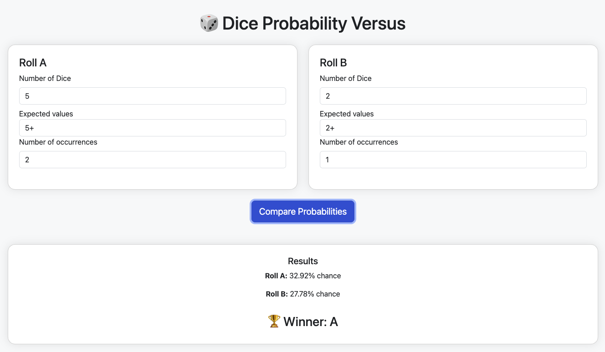

# DiceOf

Compare dice combinations and find out the most interesting dice roll



## Features
- Built with [Play Framework](https://www.playframework.com/)

### Prerequisites
- [scala](https://www.scala-lang.org/download/2.13.16.html)
- [sbt](https://www.scala-sbt.org/)

### Running Locally
```bash
sbt run
```
Visit [http://localhost:9000](http://localhost:9000) in your browser.

## License
This project is licensed under the [MIT License](LICENSE).

